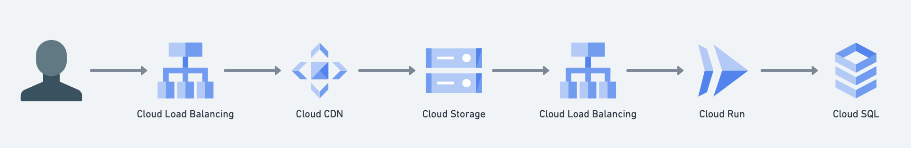
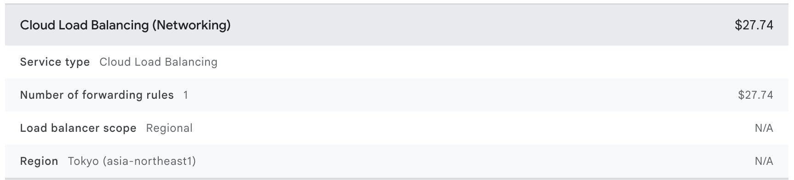
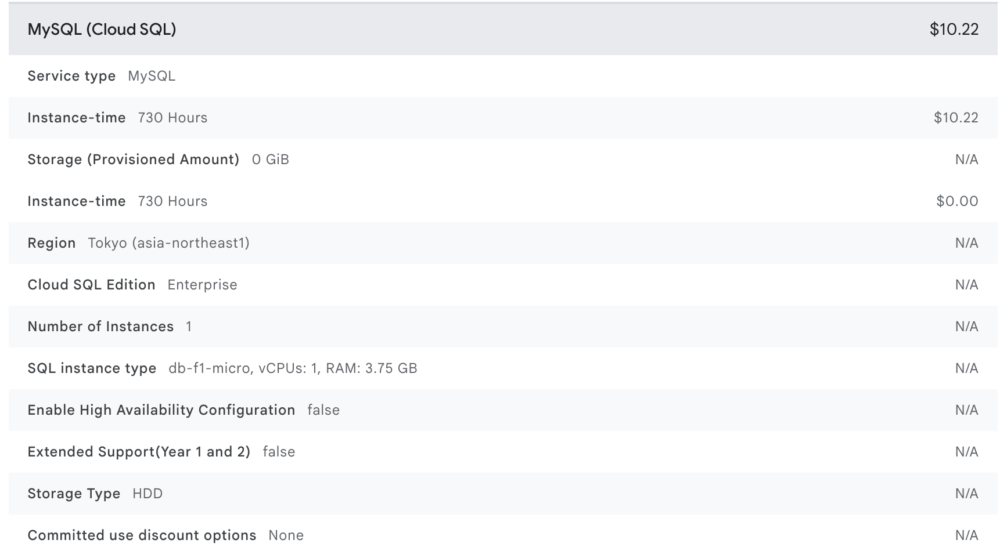

:::message info
この記事は人間が書き、AIにレビューしてもらいました
:::

## はじめに

AIによって開発が加速した現在、プロダクト開発においてアイデアを素早くプロダクトに落とし込み、実際に市場に展開することが重要になっています。しかしMVP(最小限の実用的製品)を立ち上げる際のクラウドインフラやアーキテクチャの選択は、その後のプロダクトの成長や運用に大きな影響を与えます。

本格的な構成を最初期から採用することは立派ですが、MVPが成功するかわからないものに高コストなインフラを選択することはリスクが高いです。逆に、安易に無料枠や低コストなサービスを選択すると、将来的なスケーリングや機能追加が困難になります。

この記事ではGoogle Cloudを利用し、限りなくゼロに近いコストでMVPを立ち上げ、将来的なスケーリングや機能追加を容易にするアーキテクチャを提案します。

## アーキテクチャの目的

この記事では以下の4つを満たすアーキテクチャを目指します。

- 低コスト: 月額数ドル、または無料枠に収まるほどの圧倒的な低コスト
- 運用性: 小規模サービスとして十分に運用できるシンプルさと安定性
- 拡張性: 各コンポーネントをより適した環境にスムーズに移行できる
- 柔軟性: 開発、運用始めて明らかになる要件に対応できるよう、将来取りうる技術的選択肢を狭めない

技術選定はトレードオフであるため、上記の目的を満たすために、いくつかの点を犠牲にしています。

- 可用性: 高可用性を犠牲にし、単一障害点を許容する
- スケーラビリティ: 大規模なスケーラビリティを犠牲にし、単一インスタンスでの運用を前提とする
- 信頼性: データの完全な整合性を犠牲にし、ある程度のデータ損失を許容する
- セキュリティ: 高度なセキュリティ対策を犠牲にし、基本的なセキュリティのみを提供する
- パフォーマンス: 極限までの低レイテンシを犠牲にし、ある程度の遅延を許容する

これらのどの点を犠牲にしているかは本文中で説明しているので、今回提案する内容はすべてを採用するものではなく、トレードオフを見極めて、有効な部分を採用することを推奨します。

## 理想的な構成(一例)

アプリケーションの要件によってインフラ構成は大きく異なりますが、一般的な要件のwebアプリケーションでは以下のような構成が広く採用されています。

ユーザーのリクエストはロードバランサーにたどり着き、Cloud Storageに保存されたフロントエンドのキャッシュをCloud CDNが配信します。そのフロントエンドはAPIサーバーのロードバランサーにリクエストを送り、APIサーバーがCloud SQLにアクセスしてデータを取得します。

この構成は非常に優秀であり、この時点でほとんどのケースでは十分なパフォーマンス、可用性、スケーラビリティを提供します。

しかしこれらのコンポーネントが最初期から必要なのでしょうか? プロダクトは本当にその要件なのでしょうか? 不確実性が大きい中でこの構成を採用することは、コスト、運用面での一定の負担を伴います。

実際にこの構成でのコストを試算してみましょう。ほとんどのアプリケーションにおいてMVPの段階ではアクセスが少ないです。そのため従量課金部分ではなく、それぞれのミニマムコストが支配的になります。

この中でそういったミニマムコストが発生するのはCloud Load BalancingとCloud SQLです。

Google Cloudの料金計算ツールで試算してみましょう。

https://cloud.google.com/products/calculator?hl=ja

---

まず、Cloud Load Balancingを見ていきます。詳細な料金表はこちらです。

https://cloud.google.com/load-balancing/pricing?hl=ja

Cloud Load Balancingではトラフィックを流すために転送ルールというものを設定する必要があります。この転送ルールがなければトラフィックを転送できないため、必須のものです。この転送ルールは最初の5つまで、$18.25 / 月 かかります。

---

次に、Cloud SQLを見ていきます。詳細な料金表はこちらです。

https://cloud.google.com/sql/pricing?hl=ja

DBの起動には時間がかかるため、常時起動しておく前提の価格ですが、HDDを使った最小限の構成でも $10.22 / 月 かかります。

これらを合わせると、$37.96 / 月、1ドル150円で換算すると約5700円 / 月 かかります。これは個人で扱うMVPの段階では非常に大きなコストです。また、企業であったとしても長期間、多数のMVPを立ち上げる場合、無視できないコストになります。

## アーキテクチャの解説

### アプリケーション基盤

では、どのようにしてこれらのコストを削減できるでしょうか?
実は、Cloud Runをアーキテクチャの中心として、機能をフルに活用することで、これらのコストを大幅に削減できます。

Cloud Runはコンテナをサーバーレスで実行できるサービスです。オートスケーリングやリビジョン管理など、多くの機能を備え、大規模なシステムにも対応できます。

Cloud Runでプレビュー機能としてドメインマッピングの機能が提供されています。これはロードバランサーの管理無しで独自ドメインをCloud Runに紐づけることができる機能です。これにより、ロードバランサーのミニマムコストを回避できます。

https://cloud.google.com/run/docs/mapping-custom-domains?hl=ja#run

ただしドメインマッピングにはレイテンシの問題があり、公式からも注意喚起がされています。

https://cloud.google.com/run/docs/issues?hl=ja#latency-domains

実際にどの程度レイテンシが発生するのかについては、以下の記事が参考になります。

https://zenn.dev/catnose99/scraps/ffdd08cebfad12

https://mixi-developers.mixi.co.jp/cloudrun-custom-domain-latency-20a127d40448

おおよそのオーダーとしては、100ms程度のレイテンシが発生すると考えて良さそうです。ここはトレードオフになります。

さらにCloud Runでは自動スケーリングの機能を備えていると先ほど説明しました。これはアクセスがない場合、インスタンス数を0にすることができるため、必要なときにだけコストが発生します。これにより、アクセスが少ないMVPの段階では、ほぼコストを0に抑えることが可能です。

最小インスタンス数を0に設定した場合、コールドスタートの問題を気にするかもしれません。コールドスタートとは、アクセスがあった際にインスタンスが起動するまでの遅延のことです。ではCloud Runではどの程度のコールドスタートが発生するのでしょうか?

いくつかのベンチマーク記事を参考にすると、GoやRust, C++などのコンパイル言語であれば0.1秒程度、PythonやNode.jsなどのインタプリタ言語であっても3秒程度で起動するようです。

https://zenn.dev/cloud_ace/articles/bd95501cb0cd3f

https://knmts.com/350/

https://qiita.com/kccs_kazuo_fukudome/items/a10d75d1bcb6a10d6ad3

初期段階での開発ではこの程度のコールドスタートは許容できると考えます。特にGoやRustなどのコンパイル言語であれば、ほぼ気にならないレベルです。

Cloud Runは起動しているインスタンスに対しては秒単位で課金されます。最小インスタンス数を0に設定した場合、アクセスがない場合はコストが発生しません。アクセスがあった場合でも、数秒から数十秒程度の起動時間であれば、月額数ドル程度に抑えることが可能です。また無料枠も存在するため、うまく活用すれば無料で運用することも可能です。

### データベース

---

$10.22 / 月 (24365体制の場合)のコストを受け入れられるのであれば、**Cloud SQLを使用することを強く推奨**します。Cloud SQLは非常に強力でスケーラブルなRDBMSであり、将来的な移行の手間も少なくなります。この後の説明は、それらのコストを受け入れられない場合の代替案として考えてください。

---

Google Cloudが提供するデータベースサービスにはCloud SQL、Spanner、Firestoreなどがあります。これらは非常に強力でスケーラブルなサービスですが、これらの管理コストも縮小したいです。

サービスの方向性が甘いうちは、どのようなデータベースが最適か判断できないことが多いです。その場合、最初からRDBMSではないものを選択するよりも、RDBMSを選択することで将来的な移行の柔軟性を持たせることができます。

RDBMSであればSpannerやCloudSQL、AlloyDBなどへの移行が容易です。

そこでSQLiteを使用することを提案します。SQLiteは軽量で高速なRDBMSであり、単一のファイルにデータを保存します。SQLiteを使用することに懐疑的な方もいるかも知れません。

しかしSQLiteは長年の開発で成熟した、いわば枯れた技術であり、ブラウザやモバイルアプリケーションなど、様々な環境で広く使用されています。更にwebアプリケーションにおいても、小規模というよりは更に大きな、特例的な状況ではない限りパフォーマンスが問題になることはありません。それよりも早く問題になるのはアプリケーション、ネットワーク側です。

https://sqlite.org/whentouse.html

https://runebook.dev/ja/docs/sqlite/speed

Cloud RunでSQLiteを使用する方法はいくつかあります。今回は2つ紹介します。まずはLiteStreamを使用する方法です。LiteStreamはSQLiteのデータファイルをクラウドストレージにリアルタイムでレプリケートするツールです。これにより、SQLiteのデータファイルをCloud Storageに保存し、Cloud Runのインスタンスからアクセスできるようになります。

https://litestream.io/

https://zenn.dev/kou_pg_0131/articles/google-cloudrun-litestream

インスタンスが停止、再起動しても、Cloud Storageに保存されたデータファイルを使用することで、データの永続性を確保できます。

LiteStream自体は難しい技術ではないですが、アプリケーション側の設定や運用面での負担が増えることを懸念する場合は次の方法を検討してください。

---

もう一つの方法は、Cloud Runのファイルマウント機能を利用する方法です。Cloud RunではCloud Storageをファイルシステムとしてマウントすることができ、これによりSQLiteのデータファイルをCloud Storageに保存できます。

Cloud Runのファイルマウント機能を使うことで、SQLiteのデータファイルをCloud Storageに保存し、Cloud Runのインスタンスからアクセスできるようになります。これにより、SQLiteをCloud Run上で簡単に使用することができます。

しかしこのファイルマウント機能は、Cloud Storageのオブジェクトをメモリ上にキャッシュし、非同期でCloud Storageに同期するため、複数のインスタンスで同時に書き込みを行うと競合が発生する可能性があります。その場合、最後の書き込みのみが採用されるため、データの整合性が保たれない可能性があります。

この問題を回避するためには、Cloud Runのインスタンス数を1に制限し、同時に書き込みを行わないようにすることが重要です。インスタンス数が1で足りなくなって初めて、Cloud Run自体のスペックアップやDBの移行によるスケーリングを検討してください。ほとんどのケースではインスタンス数は1つで十分です。これはCloud Runのスケーリングをトレードオフとして失っています。

また将来的にDBを移行することを考慮し、アプリケーションの中でDBを操作する部分を明確に分離しておくことを推奨します。これにより、将来的にCloud SQLやSpannerなどの他のデータベースに移行する際に、アプリケーションコードの変更を最小限に抑えることができます。

この方式について、気軽に推奨するべきではない、または避けるべきという意見もあるかもしれません。まさにこの方式には明確なデメリットがあります。

一つはパフォーマンスの問題です。SQLite自体のパフォーマンスには問題がなくとも、Cloud Storageを介してアクセスをするため、sqliteファイルが大きくなった場合に頻繁な書き込みが発生すると、その都度巨大なファイルをアップロードすることになります。そのため、DBのサイズが数GBを超える場合や、書き込みが頻繁に行われる場合には、この方法は適していないと言えます。

もう一つは、信頼性の問題です。Cloud Runインスタンスはデプロイや予期せぬ障害で突然停止することがあります。GCSへの書き込みは非同期で行われるため、SQLiteのトランザクション実行中にインスタンスが停止した場合、DBファイルが破損した状態で保存され、データが失われる可能性があります。Cloud Storageのバージョニングで過去のファイルに戻すことは理論上可能ですが、どの時点のデータが正常かを特定するのは困難であり、実質的に復旧は不可能に近いと考えた方が安全です。

これらのデメリットを、金銭的コスト、管理コストとの天秤にかけ、管理、開発コストが受け入れられるのであればLiteStreamを使用し、金銭的コストが受け入れられるのであればCloud SQLに移行することが望ましいと考えます。今回提案するのはあくまで極限までコストを抑えたい場合の一つの選択肢であり、全てのケースに適しているわけではないことを理解してください。

### アプリケーションアーキテクチャ

今回の主題とは少し外れますが、アプリケーションアーキテクチャについても言及します。

推奨パターンとしては、サーバーサイドで静的ファイルをレンダリングし、そのレンダリング結果からサーバーサイドのAPIを呼び出す構成を推奨します。

この場合、ページとして機能し、静的ファイルを返すルートと、APIとして機能しJSONなどのデータを返すルートを明確に分離します。例えば/api→API  /その他→ページ といった具合です。

これには明確な理由があります。

フロントエンドと一口に言っても、様々な技術スタック、アーキテクチャが存在します。例えばTanstack Router, SvelteなどのでSPAを構築することもできますし、Next.js, Nuxt.js, SvelteKitなどのフルスタックフレームワークを使用してSSRを行うこともできます。

これらの技術スタックはそれぞれ異なる特性を持っており、要件や将来の展望に応じて選択する必要があります。

もし最初からNext.jsのようなフルスタックフレームワークを選択した場合、将来的にフロントエンドとバックエンドを分離したい場合や、他のフレームワークに移行したい場合に困難が伴います。なぜならこれらのフレームワークはAPI通信を内部で隠蔽しているため、バックエンドとフロントエンドの境界が曖昧になるからです。

さらに、他のサービスにインテグレーションされる場合、フロントエンドが不要になることもあります。そのため、APIを持つという特性を守ることが重要です。

バックエンドとフロントエンドを分離しておくことで、フルスタックJavaScriptに移行することも容易になります。また、フロントエンドを静的ファイルとしてCloud Storageから配信することも可能となり、要件によってはBFFを構築する構成への移行も容易です。これにより、不確実性に強いアーキテクチャを構築できます。

## 最終的な構成

これまでの内容をまとめた最終的なアーキテクチャは以下のようになります。

- 管理するインフラはCloud RunとCloud Storageのみ
- DBはCloud Storageに置いたSQLiteファイル
- Cloud Runはインスタンス数を1に制限
- ドメインをそのままCloud Runに設定(プレビュー機能)
- フロントエンドは基本的にサーバーサイドでレンダリングする
- バックエンドを重視した技術スタックにする

このアーキテクチャを採用しておくことで、以下の効果が期待できます

- 初期構築のコストが限りなく小さい
  - LBやCloud SQL、VMのコストが小さい
- 要件に合わせたアーキテクチャへの移行が容易
- 必要な部分から移行できる

## 将来的な移行

上記のアーキテクチャはあくまで初期段階のものです。将来的に要件が明確になった場合にどのように移行するかのパスも提示しておきます。

### データベースを移行する

SQLiteで課題になるのが、書き込み性能です。SQLiteはファイルでデータを管理する仕組み上、書き込み中はロックがかかり、他の書き込みがブロックされます。そのため、同時に多数の書き込みが発生するようなケースではパフォーマンスが低下します。

このような場合では、Cloud SQLやSpannerなどのマネージドDBに移行することを検討してください。

移行を支援するツールはいくつか存在しています。以下に有名なものを挙げておきます。

SQLite → PostgreSQL

https://github.com/dimitri/pgloader

SQLite → MySQL

https://github.com/techouse/sqlite3-to-mysql

### アプリケーションをスケールさせる

アプリケーションランタイムのCPUがネックになった場合、Cloud Runのスケーリングを有効化することを検討してください。

その場合はSQLiteを利用するうえでの制約を回避するため、まずDBをCloud SQLなどに分離する必要があります。

その後はCloud Runのスケーリングを有効化し、必要に応じてインスタンス数を増やすことができます。

### UI/UXをスケールさせる

UI/UXへの要件が高まった場合、フロントエンドを分離することを検討してください。

基本的にはバックエンドAPIをそのまま使えるようにするのが良いです。Tanstack RouterのようなSPAフレームワークを使い、Cloud Storageから静的ファイルを配信する構成が堅牢です。

よりパフォーマンスが求められる、または外部の通信をより精密に制御したい場合、BFFとしてフルスタックフレームワーク(Next.js, Nuxt.js, SvelteKitなど)を別のCloud Runにデプロイすることも良いでしょう。

## まとめ

本記事では、不確実性の高いMVP（最小限の実用的製品）開発において、Google Cloudをいかに賢く活用するかを解説しました。初期コストを月額数ドル、あるいは無料枠に収めながら、将来の本格的なサービス拡大にも柔軟に対応できるアーキテクチャを提案しました。

その核心は、Cloud RunとSQLiteという、一見すると小規模向けに見える技術を、その特性を深く理解した上で組み合わせる点にあります。

- コストと運用のミニマム化: Cloud Load BalancingやCloud SQLといった固定費が発生しやすいサービスを避け、Cloud Runのドメインマッピング機能と、Cloud StorageにマウントしたSQLiteをデータベースとして採用。これにより、アクセスがなければほぼコストゼロという、究極の低コスト運用を実現しました。
- 柔軟性の確保: このアーキテクチャは「使い捨て」ではありません。パフォーマンスのボトルネックが明確になった時点で、データベースはCloud SQLへ、アプリケーションはCloud Runのスケーリング有効化へ、フロントエンドはSPAやBFF構成へと、必要な部分からスムーズに移行できる道筋が用意されています。バックエンドAPIを分離しておくことで、将来の技術的選択肢を狭めることなく、プロダクトの成長に合わせた最適な構成へと進化させることが可能です。
